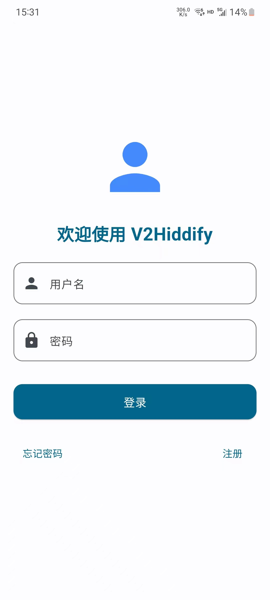
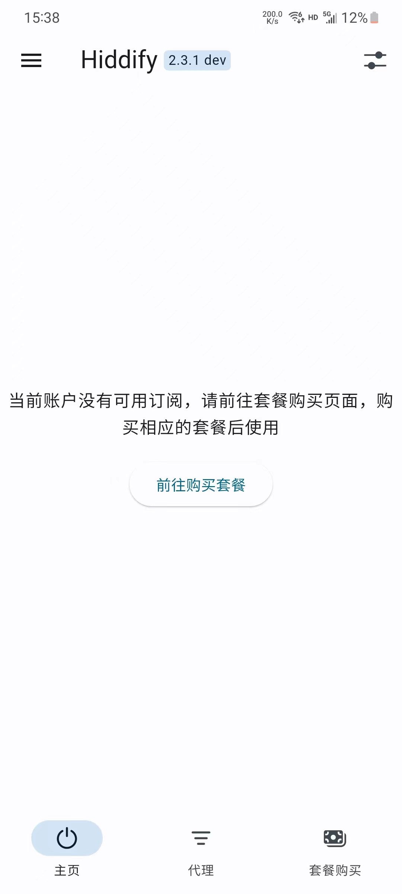
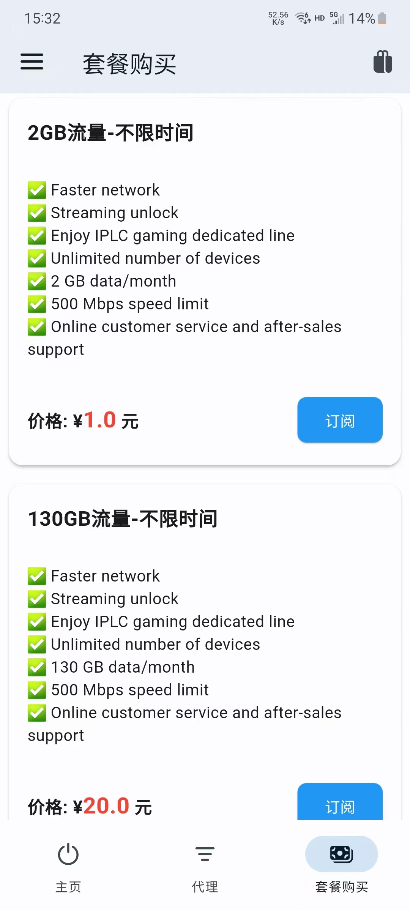
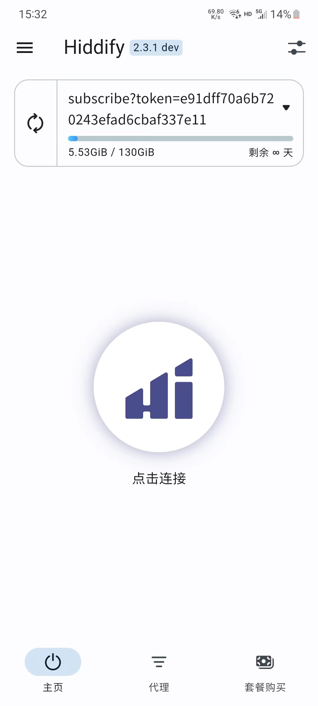
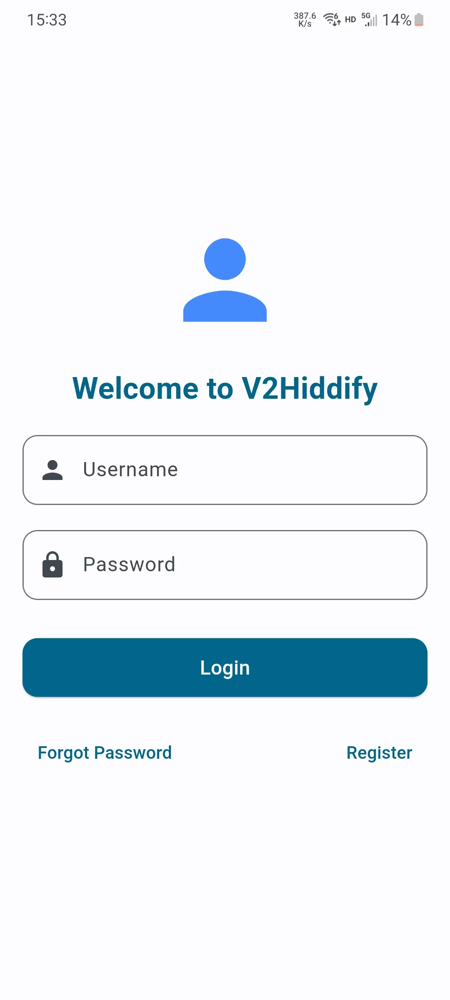
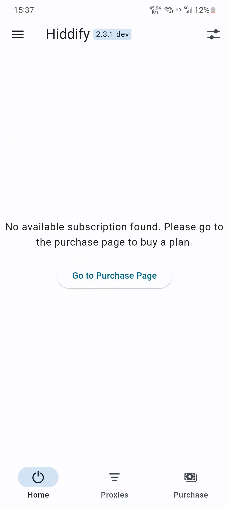
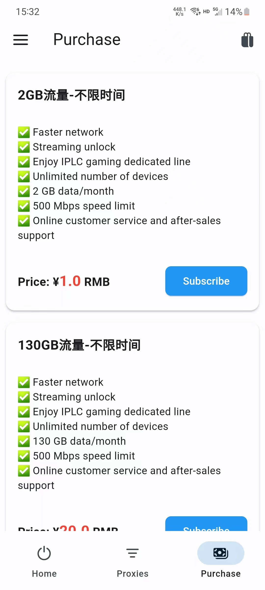
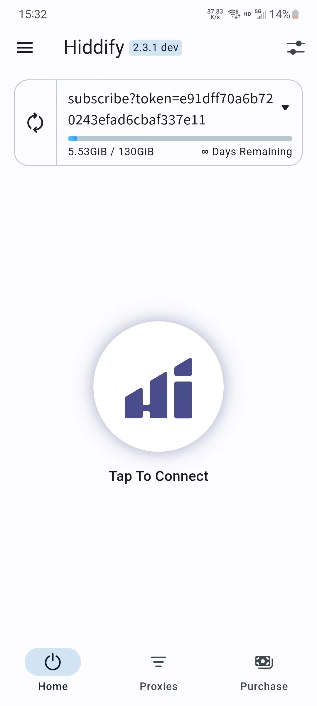
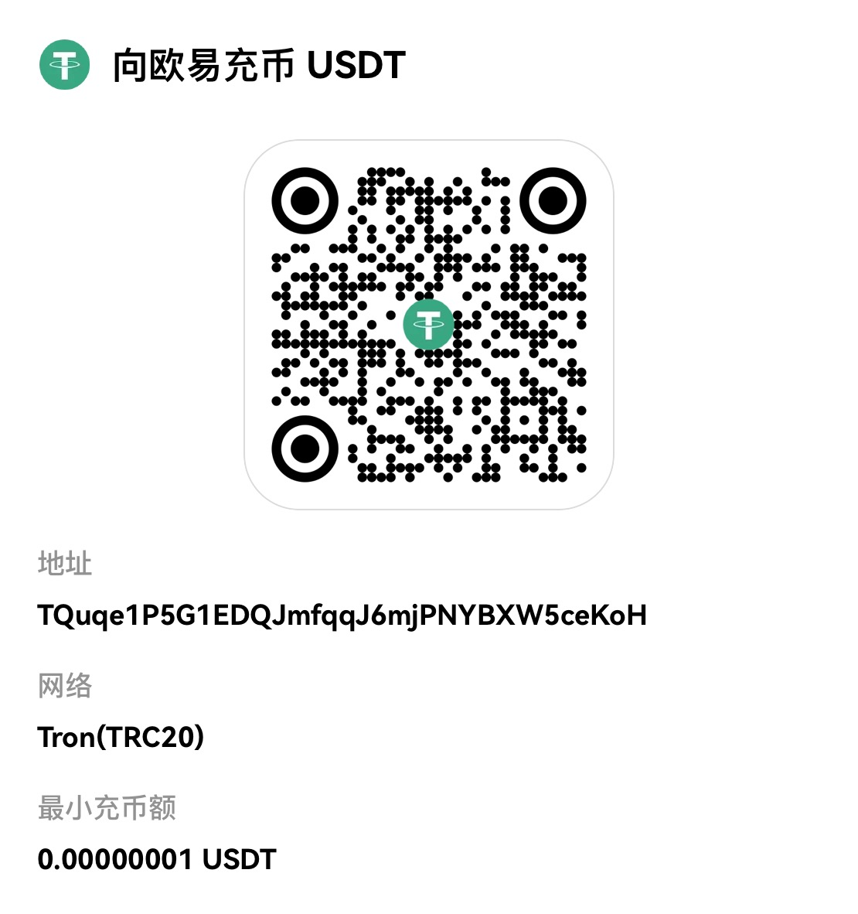

# 什么是 V2Hiddify（[View this document in English](./README_en.md)）

V2Hiddify 是基于 [Hiddify-Next](https://github.com/hiddify/hiddify-next) 开发的一个衍生项目。该项目的目的是开发一个跨平台客户端，可以直接与 V2board（Xboard）集成。用户可以使用 VPN 服务提供商的相应账户登录，自动订阅并购买套餐。  
## 项目进度
- 截止24年10月16日,所有的功能开发完毕,无致命bug.算是v1.0版本诞生.
## 加入TG群聊

欢迎加入V2Hiddify TG 群聊来交流和讨论：[V2Hiddify TG 群聊](https://t.me/V2Hiidify)。

## 功能
- [x] **oss支持**：自动域名切换
- [x] **使用面板账户登录**：允许用户使用面板账户登录。
- [x] **注册功能**：提供用户注册功能。
- [x] **忘记密码**：提供密码恢复功能。
- [x] **自动订阅**：购买套餐后自动添加订阅。
- [x] **显示套餐信息**：显示用户当前的套餐信息。
- [x] **支付集成**：提供与支付平台的集成功能。
- [x] **套餐购买**：允许用户购买不同的套餐。
- [x] **购买后自动订阅**：购买套餐后自动添加订阅。
- [x] **退出登录**：允许用户退出登录。
- [x] **语言本地化支持**：支持中英文本地化。
- [x] **邀请码**：支持生成、复制邀请码。
- [x] **钱包**：支持钱包功能、划转、提现。
- [x] **重置订阅链接**：支持重置订阅链接，并自动订阅到v2hiddidy。
## 安装步骤

### 1. 克隆仓库

首先，将项目仓库克隆到本地：

```bash
git clone https://github.com/GalenBlabla/Hiddify-with-V2board.git
cd Hiddify-with-V2board
```

### 2. 依赖准备

根据不同的操作系统，执行以下命令以准备依赖环境：

- **Windows**:

  ```bash
  make windows-prepare
  ```

- **Linux**:

  ```bash
  make linux-prepare
  ```

- **macOS**:

  ```bash
  make macos-prepare
  ```

- **iOS**:

  ```bash
  make ios-prepare
  ```

- **Android**:

  ```bash
  make android-prepare
  ```

### 3. 运行项目

在准备好依赖后，可以使用 Flutter 运行项目：

```bash
flutter run
```

### 4. 替换面板域名和机场名字

在项目目录下进行以下替换操作：

1. **替换面板域名**：

   打开```lib/features/panel/xboard/services/http_service/domain_service.dart``` 替换ossDomain为目标自己的oss地址.[oss模版](https://github.com/GalenBlabla/website-list/blob/master/websites.json)。  


2. **替换机场名字**：

   应用内，找到语言包```assets/translations/strings_zh-CN.i18n.json```（中文举例），修改第三行```"appTitle": "V2Hiddify"```。V2Hiddify就是程序应用内的名字以及欢迎界面的名字。  
   应用外，也就是应用本身的名字，需要在对应平台文件中修改，安卓示例：  
    #### 修改 `AndroidManifest.xml`

    在 `android/app/src/main/AndroidManifest.xml` 文件中，找到 `<application>` 标签中的 `android:label` 属性并修改它：

    ```xml
    <application
        android:name=".Application"
        android:banner="@mipmap/ic_banner"
        android:icon="@mipmap/ic_launcher"
        android:label="V2Hiddify"
    ```
   你仍然可以使用全局替换的方式更改你看到的目标文字，虽然这样可能会带来未知的错误。

   ~~搜索项目中所有 `V2Hiddify` 的地方，并替换为你的机场名称。例如，如果你的机场名字是 `SuperVPN`，可以用以下命令替换：~~


   ~~grep -rl 'V2Hiddify' lib/ | xargs sed -i 's/V2Hiddify/SuperVPN/g'~~

### 5. 打包应用
默认无任何代理.
根据需要打包相应平台的应用：  
如果需要配置安卓代理,在打包之前需要进入 `android` 目录下，找到 `gradle.properties` 文件，修改里面的代理 IP 和端口为自己的,如果无需代理，可忽略：

  ```properties
  org.gradle.jvmargs=-Xmx4048m -Dfile.encoding=UTF-8
  android.useAndroidX=true
  android.enableJetifier=true

  # HTTP 代理设置
  systemProp.http.proxyHost=192.168.28.36
  systemProp.http.proxyPort=7890

  # HTTPS 代理设置
  systemProp.https.proxyHost=192.168.28.36
  systemProp.https.proxyPort=7890

  # 不使用代理的主机（可选）
  systemProp.http.nonProxyHosts=localhost|127.0.0.1
  ```
**中国大陆境内务必使用gradle镜像地址下载依赖**
打开```android/gradle/wrapper/gradle-wrapper.properties```根据需要自行选择**gradle**源
```
distributionUrl=https://mirrors.cloud.tencent.com/gradle/gradle-7.6.1-bin.zip

# distributionUrl=https\://services.gradle.org/distributions/gradle-7.6.1-bin.zip
```
- Android 打包：

  ```bash
  flutter build apk
  ```

- iOS 打包：

  ```bash
  flutter build ios
  ```

- macOS 打包：

  ```bash
  flutter build macos
  ```

- Windows 打包：

  ```bash
  flutter build windows
  ```

---

通过以上步骤，你可以定制并打包适合自己面板的 V2Hiddify 客户端，方便用户使用 VPN 服务。

## V2Hiddify 示例图片

### 中文界面
<p align="center">
  
  
  
  
</p>

### English Interface
<p align="center">
  
  
  
  
</p>

## 欢迎提交 Pull Request 🎉

非常感谢你对本项目的关注！欢迎所有形式的贡献，无论是修复 bug、改进文档，还是增加新功能。如果你有好的想法或发现需要改进的地方，欢迎提交 PR！

### 如何贡献

1.Fork 仓库：点击右上角的 `Fork` 按钮，将本仓库复制到你的 GitHub 账户中。  
2.创建分支：在你的仓库中创建一个新的分支用于你的改动。  
``` git checkout -b feature/your-feature-name ```  
3.进行修改：在你的分支中进行修改、添加新功能或修复问题。  
4.提交更改：将你的修改提交到你的分支中。  
``` git add . git commit -m "描述你的更改内容" ```  
5.推送到 GitHub：将你的分支推送到你 Fork 的仓库中。  
``` git push origin feature/your-feature-name ```  
6.创建 Pull Request：在 GitHub 页面上打开你的仓库，点击 `New Pull Request` 按钮，并填写相关信息。请简要描述你的更改以及它们的作用。  
### 注意事项

- 请确保你的代码风格与项目一致。 
- 对Hiddify源码做尽可能少的改动。
- 请确保所有单元测试通过，并尽量增加新的测试以覆盖你的更改。
- 在提交 PR 之前，请先同步主仓库的最新代码。

### 我期待你的贡献！

如果你有任何疑问或需要帮助，请随时在 Issue 中提问。我会尽快回复并协助你解决问题。感谢你的支持和贡献！🚀

### 支持本项目

个人开发者不易，如果你觉得本项目对你有帮助，欢迎打赏支持。  

**钱包地址 (USDT-TRC20)：**
```
TFPvpxb5k2mYYcvABe5BrCz7Tt6BhnZxxj
```



