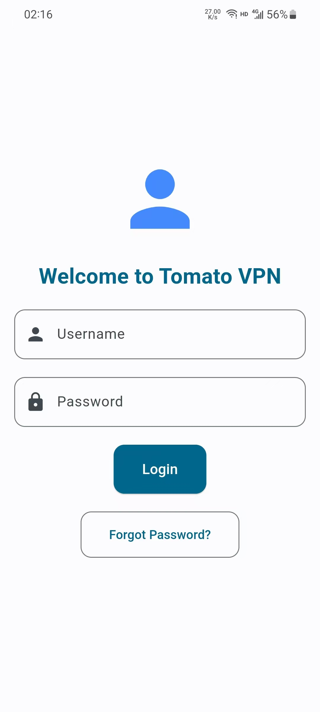
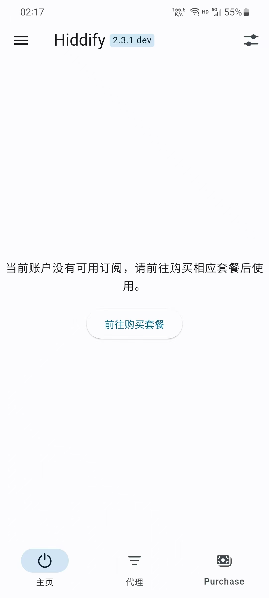
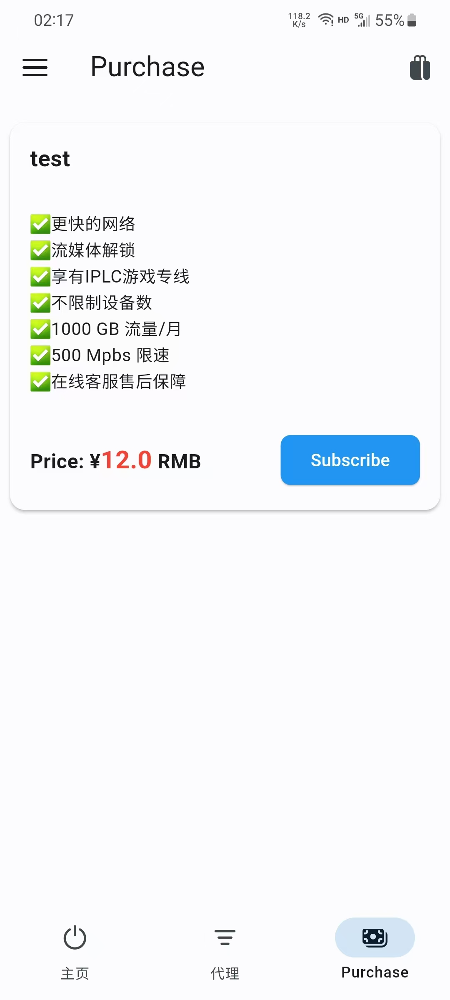
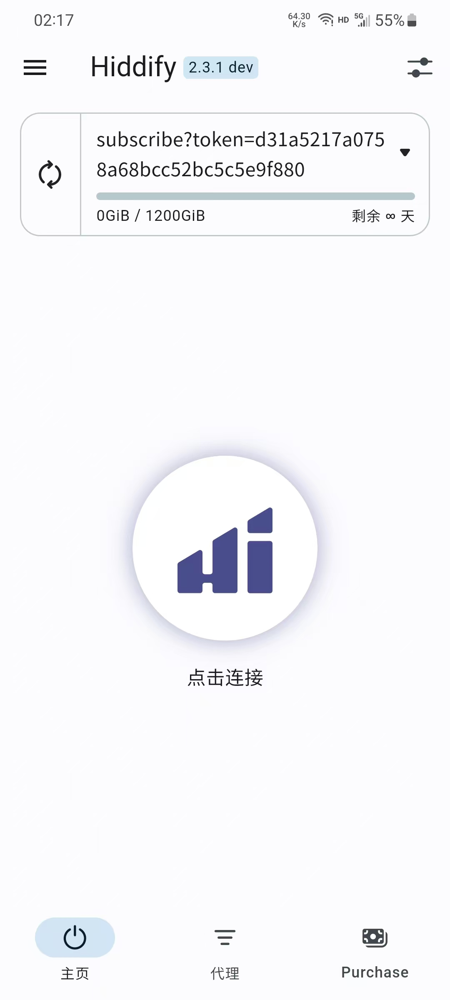

# 什么是 V2Hiddify

V2Hiddify 是基于 [Hiddify-Next](https://github.com/hiddify/hiddify-next) 开发的一个衍生项目。该项目的目的是开发一个跨平台客户端，可以直接与 V2board（Xboard）集成。用户可以使用 VPN 服务提供商的相应账户登录，自动订阅并购买套餐。

## 功能

- [x] **使用面板账户登录**：允许用户使用面板账户登录。
- [ ] **注册功能**：提供用户注册功能。
- [ ] **忘记密码**：提供密码恢复功能。
- [x] **自动订阅**：购买套餐后自动添加订阅。
- [x] **显示套餐信息**：显示用户当前的套餐信息。
- [ ] **支付集成**：提供与支付平台的集成功能。
- [ ] **套餐购买**：允许用户购买不同的套餐。
- [ ] **购买后自动订阅**：购买套餐后自动添加订阅。
- [x] **退出登录**：允许用户退出登录。

## V2Hiddify 示例图片

  
  
  
  

---

## 打包平台需求介绍

V2Hiddify 项目目前存在一个问题：对于不同的域名，需要分别打包客户端。为了简化这个过程，我计划开发一个自动打包平台。用户可以通过该平台输入目标面板的域名（如 "tomato.vpn.com"）和面板名称（如 "Tomato"），平台会自动为该面板生成配置文件并完成打包。

### 实现思路

1. **前端用户输入**：用户在平台上输入域名和面板名称。
2. **生成配置文件**：后端根据用户输入生成对应的配置文件（例如 `config.toml`）。
3. **触发打包脚本**：后端调用打包脚本（如 `build.sh`），根据配置文件进行打包。
4. **下载链接**：打包完成后，生成下载链接供用户下载。